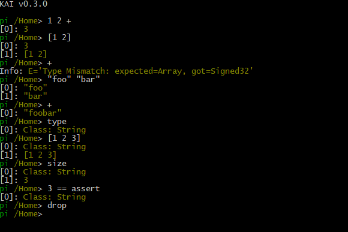

# KAI - Distributed Object Model for C++ 

[](https://ci.appveyor.com/project/cschladetsch/cppkai)
[](https://www.codefactor.io/repository/github/cschladetsch/cppkai)
[](./LICENSE)

_KAI_ is a network distributed **Object Model** for C++ with full runtime reflection, persistence, and incremental garbage collection. No macros are needed to expose fields or methods to the scripting runtime, including external code from other libraries.

Objects and *compute* can be distributed across Nodes in a Domain.

## Demo


**[▶ Live Interactive Demo](https://cschladetsch.github.io/CppKAI/Demo/ContinuationMobilityDemo/)**

Animated walk-through of agent migration, Pi-guided routing, load balancing,
and snapshot-based recovery after a simulated host failure. Source of truth:
[`ContinuationMobilityDemo.rho`](Demo/ContinuationMobilityDemo/ContinuationMobilityDemo.html).

The demo has three layers: the interactive RhoMog visualization explains the
idea, `./Bin/ContinuationMobilityDemo` runs the deterministic executable model,
and `./Scripts/network/run_continuation_migration_demo.sh` proves the runtime
path by freezing a stateful Pi workflow in one process, sending it to another
process, thawing it, resuming it, and returning `42`.

Requires GitHub Pages enabled from the `master` branch root.

## System Architecture Overview

The KAI system provides a multi-layered architecture that enables distributed object programming with multiple language frontends.

**[Project Overview](Doc/ProjectOverview.md)** - Learn about the core CppKAI runtime and KAI-aware shared web layer.

See the full diagram: **[System Architecture Overview](resources/diagrams/system-architecture-overview.md)** (Mermaid, rendered on GitHub).

### Key System Components

- **Multi-Language Frontend**: Rho (infix), Pi (stack-based), and Tau (IDL) languages with seamless interoperability
- **Interactive Console**: Real-time REPL with peer-to-peer networking capabilities
- **Distributed Object Model**: Network-transparent objects with type safety across node boundaries
- **Stack-based Execution**: High-performance virtual machine with continuation support and binary migration between nodes
- **LLM Tooling**: `RepoIndex` builds a local repo knowledge base and `RhoDataset` exports incremental training corpus records from Rho, Pi, Tau, tests, scripts, `Logs/`, history files, README files, and `Scripts/Training`. The generated manifest is the training memory.
- **Incremental Garbage Collection**: Smooth memory management without performance spikes
- **Code Generation**: Tau IDL generates proxy/agent pairs for network communication
- **Cross-platform Support**: Linux, WSL2, Windows (native), macOS
- **RhoMog Model**: Live interactive demo of continuation mobility — agent migration, Pi-guided routing, load balancing, and snapshot-based recovery after host failure

## Demo Views

[Pi](Doc/PiTutorial.md) is a postfix language.




`Window` illustrates how **Rho** is transpiled to **Pi**:


## Documentation & Architecture

### **Main Documentation Hub**
**[Documentation Guide](Doc/Documentation.md)** - Start here for organized navigation of all documentation | **[Doc/ README](Doc/README.md)**

### **System Architecture**
**[Architecture Resources](resources/README.md)** - Comprehensive system architecture documentation and diagrams
- **[Overall System Architecture](resources/diagrams/overall-system-architecture.md)** - High-level component relationships and data flow
- **[Language System Architecture](resources/diagrams/language-system-architecture.md)** - Pi/Rho/Tau translation pipeline and interoperability
- **[Console Networking Architecture](resources/diagrams/console-networking-architecture.md)** - P2P communication model and protocols
- **[Build System Architecture](resources/diagrams/build-system-architecture.md)** - CMake structure and dependencies
- **[Test System Architecture](resources/diagrams/test-system-architecture.md)** - Test infrastructure and validation workflows
- **[System Overview](resources/architecture/system-overview.md)** - Complete architectural analysis with statistics

### **Development Guides**
- **Building**: [Build Guide](Doc/OUT_OF_SOURCE_BUILD.md) | [Installation](Doc/Install.md) | [CMake Guide](CMake/README.md)
- **Languages**: [Pi Tutorial](Doc/PiTutorial.md) | [Rho Tutorial](Doc/RhoTutorial.md) | [Tau Tutorial](Doc/TauTutorial.md) | [Language System](Include/KAI/Language/README.md)
- **Networking**: [Overview](Doc/Networking.md) | [Architecture](Doc/NetworkArchitecture.md) | [Console Networking](Doc/CONSOLE_NETWORKING.md)
- **Testing**: [Test Guide](Doc/Test.md) | [Connection Testing](Doc/ConnectionTesting.md) | [Test Overview](Test/README.md)
- **Code Generation**: [Tau Code Generation](Doc/TauCodeGeneration.md) | [Tau Generate](Include/KAI/Language/Tau/Generate/README.md)
- **Project Status**: [TODO](Doc/TODO.md) | [Test Summary](Doc/TEST_SUMMARY.md)

### **Component Documentation**
- **LLM Overview**: [LmmReadme.md](Doc/LmmReadme.md) - Cache, repo indexing, and Rho dataset export
- **Core System**: [Core README](Include/KAI/Core/README.md) | [Registry](Include/KAI/Core/Object/README.md) | [Config](Include/KAI/Core/Config/README.md)
- **Executor**: [Executor README](Include/KAI/Executor/README.md) - Virtual machine and execution engine
- **Console**: [Console README](Include/KAI/Console/README.md) - Interactive shell with networking
- **Languages**: [Common](Include/KAI/Language/Common/README.md) | [Pi](Include/KAI/Language/Pi/README.md) | [Rho](Include/KAI/Language/Rho/README.md) | [Tau](Include/KAI/Language/Tau/README.md)
- **Platform Support**: [Platforms](Include/KAI/Platform/README.md) | [Linux](Include/KAI/Platform/Linux/README.md) | [Windows](Include/KAI/Platform/Windows/README.md) | [macOS](Include/KAI/Platform/OSX/README.md)

### **Testing & Examples**
- **Test Suites**: [Test Overview](Test/README.md) | [Language Tests](Test/Language/README.md) | [Console Tests](Test/Console/README.md) | [Network Tests](Test/Network/README.md)
- **Example Code**: [Examples](Examples/README.md) - Sample applications and use cases
- **Scripts**: [Scripts](Scripts/README.md) - Build and demo scripts

### **External Dependencies**
- **External Libraries**: [Ext/](Ext/README.md) - Third-party dependencies and libraries
- **Build System**: [CMake](CMake/README.md) - Build configuration and macros

### **Quick Start**

**Linux / WSL2 / macOS:**
- Build from the repository root with `./b` (networking enabled by default)
- Disable networking with `./b --no-network`
- Run the full test suite with `./run_all_tests.sh`
- Test binaries are written to `./Bin/Test`, including `TestNetwork` and `TestTau`
- Run `./Scripts/run_rho_demo.sh` for a comprehensive demo of Rho language features
- Run `./Scripts/calc_test.sh` for a demonstration of network calculation
- Run `./Scripts/network/run_continuation_migration_demo.sh` to prove continuation migration across two processes
- Run `./Scripts/network/run_continuation_migration_tmux_demo.sh` for a tmux-recordable migration demo

**Windows (native):**
- `py build.py` — configure and build
- `py run.py console` — build and launch the Console
- `py run.py tests` — build and run all tests
- `py run.py --help` — full option list

## Key Features

- **Zero-Macro Reflection**: Expose C++ types and methods to scripting without macros or source modifications
- **Distributed Computing**: Share both data and computation across networked nodes
- **Console Networking**: Real-time console-to-console communication with command sharing
- **Multiple Languages**: Use Pi (stack-based), Rho (infix), or Tau (IDL) as needed
- **Type Safety**: Full type checking across network boundaries
- **Incremental GC**: Smooth, constant-time garbage collection with no spikes
- **Cross-Platform**: Linux, WSL2, Windows (native, VS 2022/2026), macOS, Unity3D
- **Network Transparency**: Access remote objects as if they were local
- **Dynamic Load Balancing**: Automatically distribute workload across network nodes
- **RhoMog Model**: Live interactive demo of continuation mobility with fantasy-themed visualisation

## Core Components

- **Registry**: Type-safe object factory for creating, managing, and reflecting C++ objects
- **Domain**: A collection of registries across network nodes
- **Executor**: Stack-based virtual machine for executing code
- **Memory Management**: Incremental tri-color garbage collector

### Languages

- **Pi**: Stack-based RPN language inspired by Forth — prompt: `π`
- **Rho**: Python-like infix language that compiles to Pi — prompt: `ρ`
- **Tau**: Interface Definition Language (IDL) for network components

The prompt shows only the active language symbol. Command numbers remain
available through `history` and `!n`; history persists in
`~/.kai/{pi,rho}.history`. The complete data stack is printed after each command,
top-first, with `[0]` on the bottom line.

### Console Networking

KAI consoles can communicate with each other over the network in real-time:

```bash
# Console 1 (Server)
./Console
π /network start 14600
π 2 3 +

# Console 2 (Client)
./Console
π /network start 14601
π /connect localhost 14600
π /@0 10 *              # Multiply Console 1's result by 10
π /broadcast stack      # Show stack on all connected consoles
```

`localhost`, `::1`, and `127.0.0.1` are treated as the same loopback endpoint
by the ENet transport, so local console peers can use whichever form is most
convenient.

**Network Commands:**
- `/network start [port]` - Enable networking
- `/connect <host> <port>` - Connect to peer console
- `/@<peer> <command>` - Execute command on specific peer
- `/broadcast <command>` - Execute command on all peers
- `/peers` - List connected consoles

See [Console Networking Guide](Doc/CONSOLE_NETWORKING.md) for complete documentation.

## Example Code

### Pi (Stack-based)

```pi
{ dup * } 'square #  // Define a function that squares its input
5 square @           // Retrieve the function
&                    // Execute the function
```

### Rho (Infix)

```rho
fun square(x) {
    return x * x
}
result = square(5)  // result is 25
```

### Distributed Computing

```rho
node = createNetworkNode()
node.listen(14589)
node.connect("192.168.1.10", 14589)

data = [1, 2, 3, 4, 5, 6, 7, 8, 9, 10]
fun square(x) { return x * x }

result = acrossAllNodes(node, data, square)
print(result)  // [1, 4, 9, 16, 25, 36, 49, 64, 81, 100]
```

## Getting Started

### Prerequisites

- C++23 compiler: Clang 16+ (default on Linux/macOS; also supported natively on Windows), GCC 13+, or MSVC 19.5+ (VS 2022/2026)
- CMake 3.28+
- Python 3.10+ (Windows build scripts)
- Ninja (optional, faster builds on Linux/macOS)

### Building on Linux / WSL2 / macOS

```bash
git clone https://github.com/cschladetsch/CppKAI.git
cd CppKAI
git submodule init && git submodule update

./b                    # Build with networking (default)
./b --no-network       # Build without networking
./b --gcc              # Use GCC instead of Clang
./b --reconfigure      # Force CMake reconfiguration
./b --clean            # Clean and rebuild
./be                   # Build and run all tests
```

### Building on Windows (native)

```powershell
git clone https://github.com/cschladetsch/CppKAI.git
cd CppKAI
git submodule init
git submodule update --recursive

py build.py                     # Release build (Clang + Ninja by default, shell syntax ON)
py build.py --config Debug      # Debug build
py build.py --msvc              # Use MSVC + Visual Studio generator + vcpkg instead
py build.py --no-network        # Disable networking
py build.py --reconfigure       # Clean and reconfigure

py run.py console               # Build + launch Console (Pi mode)
py run.py rho                   # Build + launch Console in Rho mode
py run.py tests                 # Build + run all tests
py run.py test-pi               # Build + run TestPi only
py run.py demo                  # Build + run ContinuationMobilityDemo
py run.py console --no-build    # Just launch (skip build)
```

### Building on Windows with Clang

`py build.py` already does this by default (Ninja + auto-detected
`clang++`/`clang`, erroring out with instructions if either is missing).
Two ways to do it manually instead, e.g. for a separate build directory:

```powershell
# clang-cl (MSVC-compatible driver, uses the same VS toolchain/SDK)
cmake -B build-clang -G "Visual Studio 17 2022" -A x64 -T ClangCL
cmake --build build-clang --config Release

# real clang/clang++ (GNU-style driver, needs Ninja instead of the VS generator)
cmake -B build-clang -G Ninja -DCMAKE_C_COMPILER=clang -DCMAKE_CXX_COMPILER=clang++
cmake --build build-clang --target Console
```

Run the Ninja variant from a Developer PowerShell for VS (or the
`x64 Native Tools Command Prompt`) so Clang can find the MSVC headers/libs it
still links against on Windows.

To use MSVC + Visual Studio instead, pass `--msvc` to `build.py` (or use
`py build.py --msvc --clean` if switching an existing Ninja-configured
`build/` directory — CMake refuses to change generator in place).

### Security Configuration

Shell operations (backtick syntax, e.g. `` `pwd` `` in Rho/Pi) are **enabled
by default** (`ENABLE_SHELL_SYNTAX=ON`). On native Windows this routes
commands through WSL2's bash (`wsl.exe`), so a WSL2 distro with bash/coreutils
installed and `wsl` on PATH is required for backtick expressions to work
there; on Linux/macOS/WSL2 it uses the system shell directly. To disable it:
```bash
cmake .. -DENABLE_SHELL_SYNTAX=OFF
```
On Windows, `py build.py --disable-shell` does the same.

## Applications

### Console

```bash
./Console                    # Interactive Pi mode (default)
./Console -l rho             # Interactive Rho mode
./Console script.pi          # Execute Pi script
./Console -t 2 script.rho    # Execute with trace level 2
```

**Interactive Session:**
```
KAI Console v0.3.0
Type 'help' for available commands.

π 2 3 +
[0]: 5

π rho
Switched to Rho language mode

ρ x = 42; y = x * 2; y
[0]: 84
```

**Features:**
- Plain language prompts: `π`, `ρ`, and `$`
- Stack contents shown after every command, top-first with `[0]` at the bottom
- Per-language persistent history saved to `~/.kai/pi.history` and `~/.kai/rho.history`
- Context-sensitive help system
- Shell integration (backtick expansion, enabled by default; native Windows routes commands through WSL2's bash)
- Color-coded stack display; floating-point values use the neutral value color
- Native KAI Logger initialization for Console lifecycle, inspection, debugger
  attachment/action, and failure records

### Network Applications

Networking is enabled by default. The build includes the ENet transport layer,
Tau IDL libraries, and all network tests. The old `NetworkGenerate` command-line
tool has been removed; Tau proxy/agent generation remains available through the
Tau generator library.

Continuations are serialized as binary payloads — suspended execution can be frozen on one node, transferred over the network, and resumed on another node.

```cpp
// Domain A: register a service
Node nodeA;
nodeA.Listen(IpAddress("127.0.0.1"), 14600);
ISensorAgent agent(nodeA);

// Domain B: call it remotely
Node nodeB;
nodeB.Connect(IpAddress("127.0.0.1"), 14600);
ISensorProxy proxy(nodeB, agent.Handle());
auto future = proxy.Value();          // returns Future<int> immediately
nodeB.Step();
```

```tau
namespace Sensor {
    interface ISensor {
        int Value;
        Future<int> Measure(float range);
    }
}
```

Embed the Tau generator APIs when proxy/agent headers need to be produced from
IDL as part of a tool or build step.

## Project Structure

- **Bin**: Executable output files
- **build**: Build directory (out-of-source)
- **CMake**: Auxiliary CMake modules
- **Doc**: Documentation and tutorials
- **Ext**: External dependencies (git submodules)
- **Include**: Global include path
- **Source**: Project source code
- **Test**: Unit tests
- **build.py**: Windows build script (Clang + Ninja by default; `--msvc` for Visual Studio + vcpkg)
- **run.py**: Windows build-and-run script (console, tests, demo, etc.)

## Platforms

- Windows 10/11 (VS 2022, VS 2026)
- Linux (Ubuntu, Debian, WSL2)
- macOS (Sierra and newer)
- Unity3D (2017+)

## License

This project is licensed under the MIT License — see the [LICENSE](LICENSE) file for details.

---

## Project Statistics

- **629+** C++ source files
- **3** integrated programming languages (Pi / Rho / Tau)
- **1,780+** passing tests across Pi, Rho, Tau, and network suites (TestPi alone has 585+)
- **Full** Agent/Proxy/Domain networking over ENet UDP
- **Tau IDL** generates type-safe proxy/agent pairs from `.tau` interfaces
- **Networking on by default** — disable with `./b --no-network`
- **Single flag** `KAI_BUILD_LLM=ON` enables the local model-cache layer
- **Model storage**: `~/.cache/deepseek/models` by default
- **Repo knowledge base**: `./Bin/RepoIndex` builds a local code/test index
- **Training corpus**: `./Bin/RhoDataset` exports code, tests, scripts, `Logs/`, history, README files, and `Scripts/Training` lessons. It is silent by default and only asks when a proposed corpus change would have large impact.

**Start exploring**: Begin with the **[Documentation Guide](Doc/Documentation.md)** or dive into **[System Architecture](resources/README.md)** for technical details.
