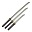
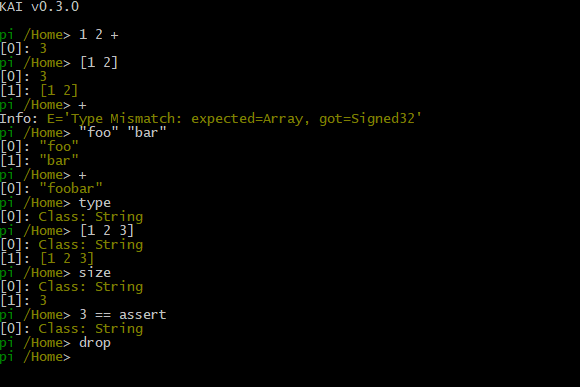

# Kai 
[](https://www.codefactor.io/repository/github/cschladetsch/kai)
[](./LICENSE.txt)
[](https://github.com/cschladetsch/kai/releases/latest)

_Kai_ is a network distributed **Object Model** for C++ with full runtime reflection, persistence, and incremental garbage collection. No Macros are needed to expose fields or methods to the scripting runtime, including external code from other libraries.

Kai provides three scripting languages - Pi, Rho and Tau. It was also the inspiration for the C# [Pyro](https://github.com/cschladetsch/Pyro) implementation, which was much easier due to .Net's reflection.

## Purpose
The purpose of KAI is to allow communication between networked nodes in as simple and direct way as possible. Current network implementation uses Raknet, but it is abstracted.

This is not limited to just data transfer - rather, *computation itself* can be shared between nodes, using a distributed **Executor** with a shared heartbeat.

If a node is over-loaded, it can push it's load out to other peers in the *Domain* that it shares.

This is all done via distributed object model, and a few languages.

### Heart of the System :heart:
At the heart of KAI are three things: A Registry, A Domain, and some Languages.

* Registry. A statically-typesafe over-the-wire object factory.
* Domain. A Local Registry that is part of the larger Newtork. Objects in a Domain are in a Registry that is qualified by the Guid of that domain.
* Languages:
  * Pi. Is RPN and is the base language.
  * Rho. Is like Python but has native support for continuations in its syntax. It transposes to Pi.
  * Tau. Is the Interface Definition Language (IDL) than is shared between nodes. In theory, it could produce code for any language.

Kai is intended to be a framework for distributed computing. In this case, that term means precisely what it implies: processes can be removed, or moved or copied between nodes in the system.

This is accomplished via *Executor*s running *Continuations* within a *Domain*. The first things to understand about Kai are the languages used, then how they are used to create processes that interact directly with the C++ run-time across the network.

This requires a solution for distributed object discovery, naming, and resolution.

Note that the base computational unit in Kai, the Continuation, is itself serialisable and able to be sent over the wire. That is the key principal of the entire framework.

## Object Model

The Core of the system is a *Registry*. It contains types, and can make instances of those times given a type name or a statically defined type number.

## Languages

### Pi

[Pi](Source/Library/Language/Pi) (see [Tests](Test/Language/TestPi) and [Tests Scripts](Test/Language/TestPi/Scripts)) is heavily influenced by [Forth](https://en.wikipedia.org/wiki/Forth_(programming_language)). It has two directly interactable stacks: one for data, and one for context. The data stack is used for operations (as is the context stack), but the context stack tells the machine `where to go next`. This is used to create the idea of a co-routine, which is then pushed up to Rho.

### Rho
[Rho](Source/Library/Language/Rho) (see [Tests](Test/Language/TestRho) and [Tests Scripts](Test/Language/TestRho/Scripts)), is an infix language much like Python, LUA or Ruby, but with native continuations and the ability to inject Pi code as any factor in an expression.

The general idea has always been to move algorithms around the network, as well as data. In this manner, *real* load-balancing can be conducted.

### Tau
Tau is an IDL (interface description language), used to specify object fields and methods via enforced and versioned contracts over the wire.

## Platforms
Currently supported platforms are:

1. **Windows 10** (VS 2017-19)
1. **Linux** (Ubuntu)
1. **macOS** (Sierra)
1. **Unity3d** (2018+)

You can create and connect Kai nodes on different machines, swap and monitor workloads, and remote manage all nodes in the system.

Kai comes with distributed tri-color garbage collection. It is incremental; there are no spikes in cost for the GC over time. It is smooth, and allows for a constant update loop times even with tens of thousands of objects, and with hundreds of objects being created each frame on the compute power of a gaming console from 2012.

There is also an Interface Definition Language (IDL) called ***Tau***, which is used to generate code for proxies and agents in the system.

Refer to the [Language Systems](Include/KAI/Language) and [implementation](Source/Library).

## Building

Prerequisites:

* A modern C++ compiler.
* [Cmake](https://cmake.org/install/).
* RakNet
* *Boost*. The specific packages required are:
  *  `filesystem`, 
  * `program-options`,
  *  `chrono` 
  * `date-time`
  *  `regex`
  * use `./install-boost-libs.sh` to install them on Ubuntu.

After this do the usual:

```bash
mkdir -p build && cd build && cmake ..
```

## Console

The basic [Console](Source/App/Console) supports both Pi and Rho as a Repl shell. It works and colored on Windows, Linux, and macOs. The following is just a basic look at the shell.



### Window
There is also a [Gui](/Source/App/Window) based on imgui.

## Examples
Basic C++/runtime interaction. First, see [Sample use of non-POD structure](Test/Source/TestClassScripting.cpp). Note that to be used by KAI, the target struct or class has no conceptual or practical requirements. Specifically, it doesn't have to derive from anything and there are no macros used to expose fields or methods:

Part of the output is:

```
[----------] 1 test from TestClassScripting
[ RUN      ] TestClassScripting.Test
Info: mystruct.ToXmlString()='
<Object type='MyStruct' name=''> <!-- no name because structure is not in a dictionary -->
  <Property name='num'>42>/Property>
  <Property name='string'>Freddy</Property>
</Object>
'

Info: stream.ToString()='Handle=55, type=MyStruct '
Info: binary_stream='BinaryStream: size=32'
```

After building, you can run the the tests yourself in ```Bin/Test/KaiTest.exe```. (Or without the `.exe` on Linux of macOS of course).

Start withe the [Unit Tests](Test) then have a look at the [Applications](Source/App).

## Networking
The entire motivation for KAI was to allow for efficient, low-latency and correct networking of object state and command execution (which results in state changes!) across a group of Objects in a Registry, a group of Registries in a Domain, and across a group of Domains in a Network System.

Read more about Kai [object and compuational distribution](Networking.md).

## Executor
A general-purpose stack-based virtual machine. I wanted two stacks (one for data, one for context). These two stacks (data and context) provide some abilities that are not available on any other non-Forth based system - especially since you can readily swap between them. That is, you can move _context_ to the data-stack, do work, then push back onto the _context_ stack.

This provides for some rich computational control. This can also result in confusion, so there is a debugger and extensive (optional) tracing available.

## Folder Structure
* *Bin*. Where to write executable output files.
* *CMake*. Auxiliary CMake modules, primarily for finding other projects and libraries like Boost and Google Test.
* *Doc*. Generated documentation.
* *Ext*. External dependencies, primarily as _git submodules_.
* *Include*. Root of the global include path. Add this to your compiler's include path.
* *Lib*. Location for built static and dynamic library files. Also add this this to your compilers library path.
* *Source*. The root for the source code of the project.
* *Test*. Unit tests. Output goes to *Bin/Tests*.

## Interesting Files and locations
* The Test scripts for [Pi](Test/Language/TestPi/Scripts) shows the basics of pi.
* Similarly, the test scripts for [Rho](Test/Language/TestRho/Scripts) show that it's a minimalist Python-like system. Note That Rho translates to pi, and Pi transcribes very efficiently from either text or binary.
* The top-level [Include folder](Include/KAI) and [Source Folder](Source).
* [Installation](Install.md). Some information on how to install and build the system.
* [Tests](Test/Readme.md). Describes the Google Tests that indicate what doesn't currently work.
* The [top level CMake file](CMakeLists.txt).

## Installing and Running
See [Install.md](Install.md) for installation instructions.

The project will build using _CMake_ via _Visual Studio 2019_. No more mucking around with various *nix shells on Windows.

Your safest first bet is to build the *Console* app. This gives you a *Pi* Repl console.

_RakNet_ is integrated but needs some work to get back to connecting to remote nodes etc., due to recent changes in *Raknet*. This is a top priority.

_KAI_ has various dependencies, but can be built with many sub-sets. That is, if you don't want to use [ImGui](https://github.com/ocornut/imgui) you can stick with text-based (colored) [Console](Source/App/Console).

Feel free to contact [me](matilto:christian.schladetsch@gmail.com) with any questions about building or use of the system.

## Conclusion
This library will be useful to those that want to expose C++ types and instances to the runtime, and across the network.

It allows you to script C++ in a very simple way. Adding a new 'built-in type' to the system requires no macros, but just defining the type-traits for your class. No modifications to any class is required. After that you can script with any type and instances as you wish.

This means you can expose and script other classes as well, including those in a library that you do not have the source code to.

To be clear: you do not have to change the source code of a class in order to access and use it at runtime with KAI. Further, these exposed classes are directly accessible via the Network.

A REPL [Console](Source/App/Console) is also supplied, as well as a [Windowed](Source/App/Window) application on all platforms 


